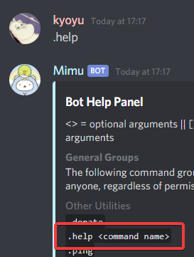
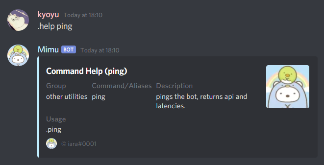
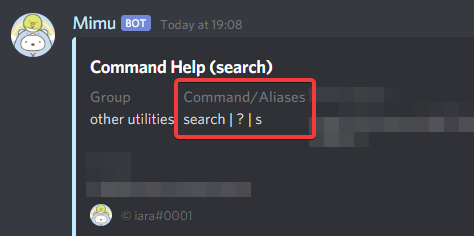

# General Command Information
> [!TIP] Here you will find **general information** for;
> - running commands
> - basic structure of commands
> - how commands work

> [!WARNING] You will notice the use of `[]` and `<>` throughout the documentation and help related commands.
>
> Here is what they stand for;
> - `<>` Optional - Whatever defined within `<>` is optional and commands can work without it.
> - `[]` Mandatory - Everything within `[]` is necessary for commands to work correctly.

## Running Commands
Commands are run simply by sending the following structure in chat:
> `[`prefix`][`alias`] <`arguments **...**`>`

> [!NOTE] `[ arguments ... ]` stands for an **optional** amount of arguments accepted by the command, see the [arguments section](commands?id=arguments) for more information on arguments.

### Examples
- `.help` - Shows the help dialog in chat.

---

- `.help ping` - Shows information dialog on a particular command where "ping" is an `<`optional`>` alias argument.

---

### Prefixes
> [!TIP] Mimu's default prefix is `.`
>
> This is because it's easy to access for mobile users, it's small and straight to the *point*.
>
> You can also use `@Mimu` as a "prefix" to execute commands.

A prefix is used to "activate" the bot and allow you to run commands on Mimu only. This is a feature known throughout bots and is generally customizable.
For your convenience we've allowed the ability to customize the prefix using [the set command](/commands/set/).

***Example with @Mention:***

> [!WARNING] **Forgot your prefix?**
>
> You can reset your prefix by mentioning `@Mimu` and using [the set command](/commands/set/).
>
> *Mimu will remind you of what your server's prefix is set to if you don't provide a command:*
>
> 

### Aliases
> [!TIP] A list of commands and aliases can be easily accessed by running the `help` command.
>
> Information on a particular command can be accessed by running the `help` command with another command's alias as the first `argument`.

Aliases are parts that you put next to a prefix to run a command. Commands can have multiple triggers or a single alias to allow you to execute the command in different ways.

*An example of a command having multiple aliases:*

### Arguments
Coming soon . . .
