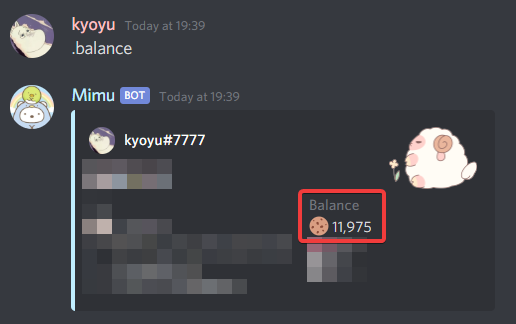

# Command - set

### Triggers
- `set`
- `config`
- `settings`
- `setting`

### Description
This command is used to adjust the settings in your server. Most things that can be customized or changed are managed with this command.
This command will display all settings if no arguments are provided.

### Usage

- set prefix `[prefix]`
- set currency `[currency symbol]`
> [!TIP] Currency symbols are generally set to "emotes" and is set to :cookie: by default:
> 
- set startval `[value #]`
- set dailyvalmax `[value #]`
- set dailyvalmin `[value #]`
- set workvalmax `[value #]`
- set workvalmin `[value #]`
- set betmax `[value #]`
- set betmin `[value #]`
- set dailycooldown `[hours #]`
- set workcooldown `[hours #]`
- set pickchannels `#channel ...`
- set picktype `multiple/multi/one/single`
- set pickvalmax
- set pickvalmin `[value #]`
- set blacklist `#channel ...`
- set advancedmode `<on/off>`
- set shop `<add/+/remove/-/edit>`
- set embedcolor `[hex code]`
- set autodelete `<on/off>`
- set greetmsg `[msg]`
- set leavemsg `[msg]`
- set greetchannel `#channel`
- set leavechannel `#channel`
- set pickspeed `[speed # or setting]`
- set roleincome `[hourly/daily/weekly] [value #] [role]`
